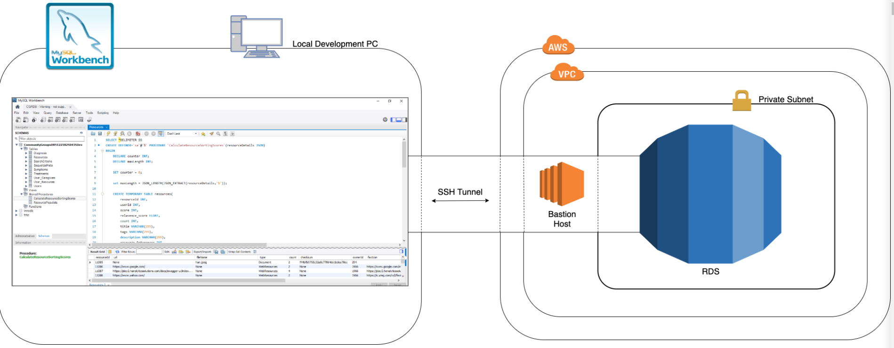

# Exporting AWS RDS Snapshot to S3 #

### What is this repository for? ###

* Setting up SSH Tunnel to AWS RDS DB instance
in a private subnet
* Using MySQL Workbench to connect to RDS DB instance
* Taking RDS Snapshot
* Exporting RDS Snapshot to destinated S3 bucket

### SSH Tunnel to AWS RDS DB Instance ###

#### Step 1: Deploy AWS RDS instance ####

#### Step 2: Configure the AWS RDS instance ####

#### Step 2a: Specify DB instance name & username, password ####

#### Step 2b: Specify connectivity configuration of the DB instance ####

#### DB instance Deployed ####

#### Step 3: Deploy EC2 instance - Bastion Host within the same VPC ####

#### Created EC2 keypair for EC2 instance ####

#### Bastion Host Deployed within the same VPC as RDS DB instance ####

#### Add the Bastion Host security group to the RDS inbound rules ####

#### Step 4: Use MySQL Workbench to created SSH Tunnel to RDS Instance ####

#### Add the EC2 public IP and RDS endpoint in MySQL Workbench ####

#### Populate the RDS DB instance ####

#### Step 5: Export the RDS snapshot to S3 bucket ####

* First take DB snapshot of the RDS DB instance

* Select the DB snapshot and then select Export to S3

* Create an S3 bucket for the destinated bucket to store exported DB snapshot

* Select the S3 bucket created to store the exported DB snapshot

* Create a new IAM role that provides permission to RDS instance to access S3 for export

* The IAM role created for RDS export to S3

* Create the Customer Managed Keys for export

#### Final Result of Exported Snapshot in S3 Bucket ####

#### Apache Parquet format for Exported DB snapshot ####

---------------------------------------------------------

## AWS RDS DB restore from snapshot (backup) ##

### AWS RDS DB instance is restored from the snapshot ###

### Updated MySQL Workbench client with the new RDS endpoint to connect ###

### Now able to successfully connect to the restored DB instance and see MySQL queries ###

